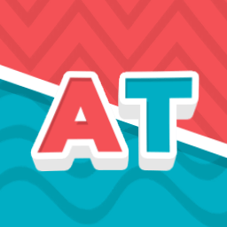

<a name="readme-top"></a>

[![Contributors][contributors-shield]][contributors-url]
[![Forks][forks-shield]][forks-url]
[![Stargazers][stars-shield]][stars-url]
[![Issues][issues-shield]][issues-url]
[![MIT License][license-shield]][license-url]

<!-- PROJECT LOGO -->
<br />
<div align="center">
  <a href="https://github.com/Rojta/activity-tracker-djs">
    
  </a>

  <h3 align="center">Activity Tracker</h3>

  <p align="center">
    Simple Discord.js v14 bot that tracks user activity for a specific application name and saves it to a database.
    <br />
    <a href="https://github.com/Rojta/activity-tracker-djs/issues">Report Bug</a>
    ·
    <a href="https://github.com/Rojta/activity-tracker-djs/issues">Request Feature</a>
  </p>
</div>

<!-- TABLE OF CONTENTS -->
<details>
  <summary>Table of Contents</summary>
  <ol>
    <li>
      <a href="#about-project">About The Project</a>
      <ul>
        <li><a href="#built-with">Built With</a></li>
      </ul>
    </li>
    <li>
      <a href="#getting-started">Getting Started</a>
      <ul>
        <li><a href="#prerequisites">Prerequisites</a></li>
        <li><a href="#installation">Installation</a></li>
      </ul>
    </li>
    <li><a href="#usage">Usage</a></li>
    <li><a href="#roadmap">Roadmap</a></li>
    <li><a href="#contributing">Contributing</a></li>
    <li><a href="#license">License</a></li>
    <li><a href="#contact">Contact</a></li>
    <li><a href="#acknowledgments">Acknowledgments</a></li>
  </ol>
</details>

## About The Project

<a name="about-project"></a>

### Built With

- [![Discord.js][discord.js]][discordjs-url]

<p align="right">(<a href="#readme-top">back to top</a>)</p>

<!-- GETTING STARTED -->

## Getting Started

### Prerequisites

- npm
  ```sh
  npm install npm@latest -g
  ```

### Installation

1. Clone the repo
   ```sh
   git clone https://github.com/Rojta/activity-tracker-djs.git
   ```
2. Install NPM packages
   ```sh
   npm install
   ```
3. Copy `.evn.example` and rename it to `.env`
4. Modify the `.env` file with your information.
5. Run the application

```sh
npm run dev
```

<p align="right">(<a href="#readme-top">back to top</a>)</p>

<!-- ROADMAP -->

## Roadmap

- [ ] Add Changelog
- [ ] Add logging to file
- [ ] Add support for multiple applications

See the [open issues](https://github.com/Rojta/activity-tracker-djs/issues) for a full list of proposed features (and known issues).

<p align="right">(<a href="#readme-top">back to top</a>)</p>

<!-- CONTRIBUTING -->

## Contributing

Contributions are what make the open source community such an amazing place to learn, inspire, and create. Any contributions you make are **greatly appreciated**.

If you have a suggestion that would make this better, please fork the repo and create a pull request. You can also simply open an issue with the tag "enhancement".
Don't forget to give the project a star! Thanks again!

1. Fork the Project
2. Create your Feature Branch (`git checkout -b feature/AmazingFeature`)
3. Commit your Changes (`git commit -m 'Add some AmazingFeature'`)
4. Push to the Branch (`git push origin feature/AmazingFeature`)
5. Open a Pull Request

<p align="right">(<a href="#readme-top">back to top</a>)</p>

<!-- LICENSE -->

## License

Distributed under the MIT License. See `LICENSE.txt` for more information.

<p align="right">(<a href="#readme-top">back to top</a>)</p>

<!-- CONTACT -->

## Contact

Ivan Rojtinic - ivan@rojtinic.com

Project Link: [https://github.com/Rojta/activity-tracker-djs](https://github.com/Rojta/activity-tracker-djs)

<p align="right">(<a href="#readme-top">back to top</a>)</p>

<!-- ACKNOWLEDGMENTS -->

## Acknowledgments

- [Choose an Open Source License](https://choosealicense.com)
- [Img Shields](https://shields.io)
- [ReadME Template](https://github.com/othneildrew/Best-README-Template)
- [Logo Template](https://auto.creavite.co/)

<p align="right">(<a href="#readme-top">back to top</a>)</p>

<!-- MARKDOWN LINKS & IMAGES -->
<!-- https://www.markdownguide.org/basic-syntax/#reference-style-links -->

[contributors-shield]: https://img.shields.io/github/contributors/Rojta/activity-tracker-djs.svg?style=for-the-badge
[contributors-url]: https://github.com/Rojta/activity-tracker-djs/graphs/contributors
[forks-shield]: https://img.shields.io/github/forks/Rojta/activity-tracker-djs.svg?style=for-the-badge
[forks-url]: https://github.com/Rojta/activity-tracker-djs/network/members
[stars-shield]: https://img.shields.io/github/stars/Rojta/activity-tracker-djs.svg?style=for-the-badge
[stars-url]: https://github.com/Rojta/activity-tracker-djs/stargazers
[issues-shield]: https://img.shields.io/github/issues/Rojta/activity-tracker-djs.svg?style=for-the-badge
[issues-url]: https://github.com/Rojta/activity-tracker-djs/issues
[license-shield]: https://img.shields.io/github/license/Rojta/activity-tracker-djs.svg?style=for-the-badge
[license-url]: https://github.com/Rojta/activity-tracker-djs/blob/main/LICENSE.txt
[discord.js]: https://img.shields.io/badge/discord.js-5c69eb?style=for-the-badge&logo=discord&logoColor=white
[discordjs-url]: https://discord.js.org/
